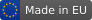

# Made in EU



A central visibility point for indicating that a piece of software comes from the
**European Union**.

The idea is simple: drop a small, recognizable badge into your `README`, your docs,
your website or your release page so that anyone — users, contributors, customers,
public institutions — can tell at a glance that the project is built in the EU.
One consistent mark, instead of everyone inventing their own.

## Why

European software is everywhere, but it rarely *says so*. Digital sovereignty,
procurement preferences ("buy European"), GDPR-by-default, and the simple wish to
support local ecosystems are all easier when provenance is visible. A shared badge
makes that provenance a one-line copy-paste.

## Usage

Two interchangeable forms live under [`software-badge/`](software-badge/).

### 1. Self-hosted SVG (recommended)

A fixed, cacheable, fully vector file — no external service, no tracking, scales to
any size. Either reference it from this repo or copy it into your own.

```markdown

```

```html

```

### 2. shields.io

If you prefer the shields.io pipeline, the ready-made URL is in
[`software-badge/markdown.md`](software-badge/markdown.md). It carries the EU flag
as an embedded logo, so it needs no extra hosting.

The badge shows the EU flag (official blue `#003399`, gold `#FFCC00` stars) on the
left and **Made in EU** on the standard slate-grey field on the right.

## A fun fact (and the point)

This repository — a project literally about European software sovereignty — is
hosted on **GitHub**, owned by Microsoft, a US company. That little irony is, on its
own, a fair illustration of the scale of the problem: even when we set out to wave
the European flag, the ground we stand on is more often than not American.

It is kept here for now precisely because that is where the world's developers
already are, and visibility is the whole purpose. But the hope is that one day this
note will be obsolete — that the badge will live on European infrastructure, and
that "Made in EU" will be the unremarkable default rather than a statement. 🇪🇺

Until then: consider this both a badge and a small reminder.

## Contributing

Variants are welcome — different sizes, styles (`flat`, `flat-square`,
`for-the-badge`), languages, or a dark-mode version. Open an issue or a pull
request. Please keep the EU flag in its official colours and proportions.

## License

[MIT](LICENSE) — use it anywhere, in any project, commercial or not, no attribution
required. The lower the friction, the more places the flag can fly.
